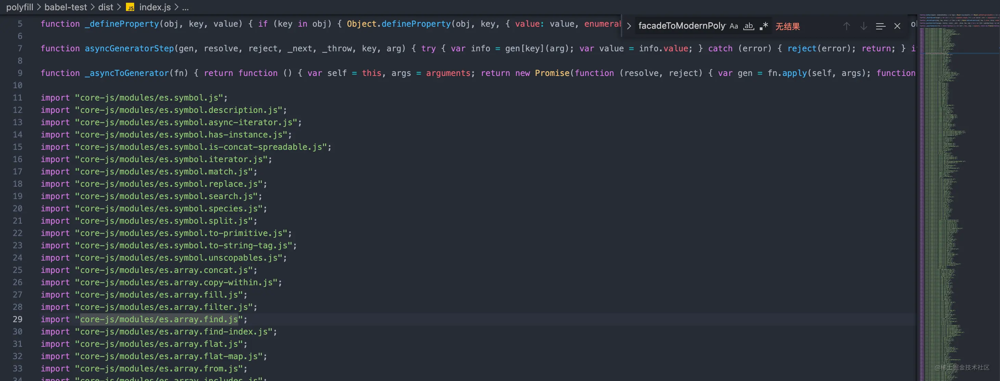
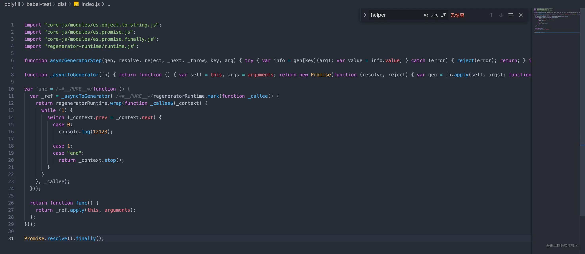
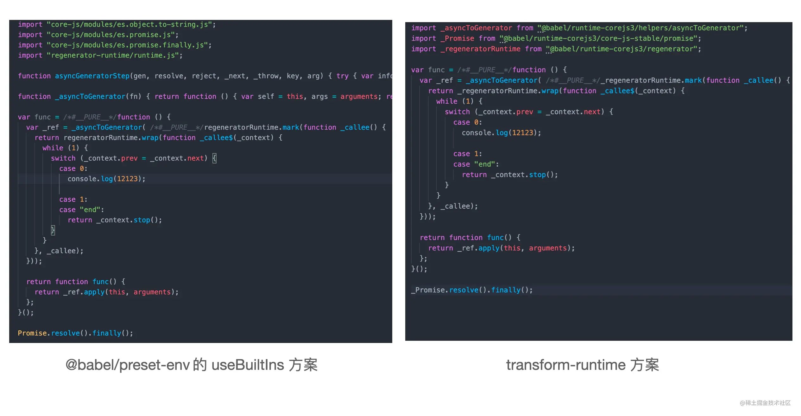
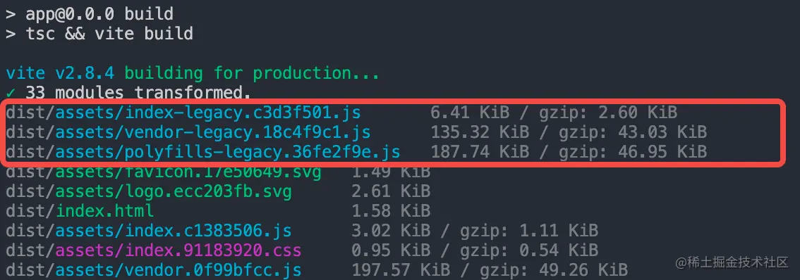
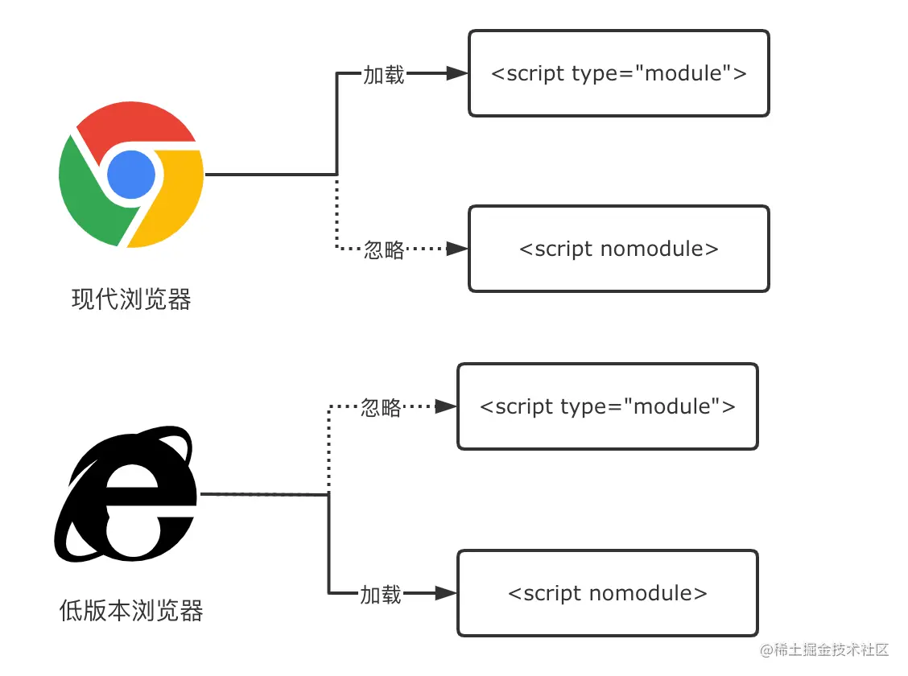

# 语法降级和polyfill

通过 Vite 构建我们完全可以兼容各种低版本浏览器，打包出既支持现代(Modern)浏览器又支持旧版(Legacy)浏览器的产物。

某些低版本浏览器并没有提供 Promise 语法环境以及对象和数组的各种 API，甚至不支持箭头函数语法，代码直接报错，从而导致线上白屏事故的发生，尤其是需要兼容到IE 11、iOS 9以及Android 4.4的场景中很容易会遇到。

旧版浏览器的语法兼容问题主要分两类: **语法降级问题和 Polyfill 缺失问题**。前者比较好理解，比如某些浏览器不支持箭头函数，我们就需要将其转换为function(){}语法；而对后者来说，Polyfill本身可以翻译为垫片，也就是为浏览器提前注入一些 API 的实现代码，如Object.entries方法的实现，这样可以保证产物可以正常使用这些 API，防止报错。

这两类问题本质上是通过前端的编译工具链(如Babel)及 JS 的基础 Polyfill 库(如corejs)来解决的，不会跟具体的构建工具所绑定。也就是说，对于这些本质的解决方案，在其它的构建工具(如 Webpack)能使用，在 Vite 当中也完全可以使用。

## 底层工具链

### 1. 工具概览

解决上述提到的两类语法兼容问题，主要需要用到两方面的工具，分别包括:

- 编译时工具。代表工具有@babel/preset-env和@babel/plugin-transform-runtime。

- 运行时基础库。代表库包括core-js和regenerator-runtime。

编译时工具的作用是在代码编译阶段进行语法降级及添加 polyfill 代码的引用语句，如:

```js
import "core-js/modules/es6.set.js"
```

由于这些工具只是编译阶段用到，运行时并不需要，我们需要将其放入package.json中的devDependencies中。

而运行时基础库是根据 ESMAScript官方语言规范提供各种Polyfill实现代码，主要包括core-js和regenerator-runtime两个基础库，不过在 babel 中也会有一些上层的封装，包括：

- @babel/polyfill(https://link.juejin.cn/?target=https%3A%2F%2Fbabeljs.io%2Fdocs%2Fen%2Fbabel-polyfill)
- @babel/runtime(https://link.juejin.cn/?target=https%3A%2F%2Fbabeljs.io%2Fdocs%2Fen%2Fbabel-runtime)
- @babel/runtime-corejs2(https://link.juejin.cn/?target=https%3A%2F%2Fbabeljs.io%2Fdocs%2Fen%2Fbabel-runtime-corejs2)
- @babel/runtime-corejs3(https://link.juejin.cn/?target=https%3A%2F%2Fbabeljs.io%2Fdocs%2Fen%2Fbabel-runtime-corejs3)

看似各种运行时库眼花缭乱，其实都是core-js和regenerator-runtime不同版本的封装罢了(@babel/runtime是个特例，不包含 core-js 的 Polyfill)。这类库是项目运行时必须要使用到的，因此一定要放到package.json中的dependencies中！

### 2. 实际使用

了解了基本概念后，接下来我们来通过代码实操的方式来学习这些工具，代码我也已经放到了[仓库](https://link.juejin.cn/?target=https%3A%2F%2Fgithub.com%2Fsanyuan0704%2Fjuejin-book-vite%2Ftree%2Fmain%2Fpolyfill%2Fbabel-test)中，你可以对照学习。

如果你没拉取仓库的代码，可以先按照如下的命令初始化项目:

```shell
mkdir babel-test
npm init -y
```

然后安装一些必要的依赖:

```shell
pnpm i @babel/cli @babel/core @babel/preset-env
```

我解释一下各个依赖的作用:

- @babel/cli: 为 babel 官方的脚手架工具，很适合我们练习用。
- @babel/core: babel 核心编译库。
- @babel/preset-env: babel 的预设工具集，基本为 babel 必装的库。

接着新建 src 目录，在目录下增加index.js文件:

```js
const func = async () => {
  console.log(12123)
}

Promise.resolve().finally();
```

你可以看到，示例代码中既包含了高级语法也包含现代浏览器的API，正好可以针对语法降级和 Polyfill 注入两个功能进行测试。

接下来新建.babelrc.json即 babel 的配置文件，内容如下:

```json
{
  "presets": [
    [
      "@babel/preset-env", 
      {
        // 指定兼容的浏览器版本
        "targets": {
          "ie": "11"
        },
        // 基础库 core-js 的版本，一般指定为最新的大版本
        "corejs": 3,
        // Polyfill 注入策略，后文详细介绍
        "useBuiltIns": "usage",
        // 不将 ES 模块语法转换为其他模块语法
        "modules": false
      }
    ]
  ]
}
```

其中有两个比较关键的配置: targets和usage。

我们可以通过 targets 参数指定要兼容的浏览器版本，你既可以填如上配置所示的一个对象:

```json
{
  "targets": {
    "ie": "11"
  }
}
```

也可以用 [Browserslist](https://link.juejin.cn/?target=https%3A%2F%2Fgithub.com%2Fbrowserslist%2Fbrowserslist) 配置语法:

```json
{ 
  // ie 不低于 11 版本，全球超过 0.5% 使用，且还在维护更新的浏览器
  "targets": "ie >= 11, > 0.5%, not dead"
}
```


Browserslist 是一个帮助我们设置目标浏览器的工具，不光是 Babel 用到，其他的编译工具如postcss-preset-env、autoprefix中都有所应用。对于Browserslist的配置内容，你既可以放到 Babel 这种特定工具当中，也可以在package.json中通过browserslist声明:

```json
// package.json
{ 
  "browserslist": "ie >= 11"
}
```

或者通过.browserslistrc进行声明:

```html
// .browserslistrc
ie >= 11
```

在实际的项目中，一般我们可以将使用下面这些最佳实践集合来描述不同的浏览器类型，减轻配置负担:

```html
// 现代浏览器
last 2 versions and since 2018 and > 0.5%
// 兼容低版本 PC 浏览器
IE >= 11, > 0.5%, not dead
// 兼容低版本移动端浏览器
iOS >= 9, Android >= 4.4, last 2 versions, > 0.2%, not dead
```

对于这些配置对应的具体浏览器列表，大家可以去 [browserslist.dev](https://link.juejin.cn/?target=https%3A%2F%2Fbrowserslist.dev) 站点查看:

好，在说明了目标浏览器的配置之后，接下来我们来看另外一个重要的配置——useBuiltIns，它决定了添加 Polyfill 策略，默认是 false，即不添加任何的 Polyfill。你可以手动将useBuiltIns配置为entry或者usage，接下来我们看看这两个配置究竟有什么区别。

首先你可以将这个字段配置为entry，需要注意的是，entry配置规定你必须在入口文件手动添加一行这样的代码:

```js
// index.js 开头加上
import 'core-js';
```

接着在终端执行下面的命令进行 Babel 编译:

```shell
npx babel src --out-dir dist
```

产物输出在dist目录中，你可以去观察一下产物的代码:



Babel 已经根据目标浏览器的配置为我们添加了大量的 Polyfill 代码，index.js文件简单的几行代码被编译成近 300 行。实际上，Babel 所做的事情就是将你的import "core-js"代码替换成了产物中的这些具体模块的导入代码。

但这个配置有一个问题，即无法做到按需导入，上面的产物代码其实有大部分的 Polyfill 的代码我们并没有用到。接下来我们试试useBuiltIns: usage这个按需导入的配置，改动配置后执行编译命令:

```shell
npx babel src --out-dir dist
```

同样可以看到产物输出在了dist/index.js中，内容如下所示：



>Polyfill 代码主要来自 corejs 和 regenerator-runtime，因此如果要运行起来，必须要装这两个库。

可以发现 Polyfill 的代码精简了许多，真正地实现了按需 Polyfill 导入。因此，在实际的使用当中，还是推荐大家尽量使用`useBuiltIns: "usage"`，进行按需的 Polyfill 注入。

我们来梳理一下，上面我们利用@babel/preset-env进行了目标浏览器语法的降级和Polyfill注入，同时用到了core-js和regenerator-runtime两个核心的运行时库。但@babel/preset-env 的方案也存在一定局限性:

- 如果使用新特性，往往是通过基础库(如 core-js)往全局环境添加 Polyfill，如果是开发应用没有任何问题，如果是开发第三方工具库，则很可能会对全局空间造成污染。
- 很多工具函数的实现代码(如上面示例中的_defineProperty方法)，会在许多文件中重现出现，造成文件体积冗余。

### 3. 更优的 Polyfill 注入方案: transform-runtime

接下来要介绍的transform-runtime方案，就是为了解决@babel/preset-env的种种局限性。

>需要提前说明的是，transform-runtime方案可以作为@babel/preset-env中useBuiltIns配置的替代品，也就是说，一旦使用transform-runtime方案，你应该把useBuiltIns属性设为 false。

接下来我们来尝试一下这个方案，首先安装必要的依赖:

```shell
pnpm i @babel/plugin-transform-runtime -D
pnpm i @babel/runtime-corejs3 -S
```

我解释一下这两个依赖的作用: 前者是编译时工具，用来转换语法和添加 Polyfill，后者是运行时基础库，封装了core-js、regenerator-runtime和各种语法转换用到的工具函数。

>core-js 有三种产物，分别是core-js、core-js-pure和core-js-bundle。第一种是全局 Polyfill 的做法，@babel/preset-env 就是用的这种产物；第二种不会把 Polyfill 注入到全局环境，可以按需引入；第三种是打包好的版本，包含所有的 Polyfill，不太常用。@babel/runtime-corejs3 使用的是第二种产物。

接着我们对.babelrc.json作如下的配置:

```js
{
  "plugins": [
    // 添加 transform-runtime 插件
    [
      "@babel/plugin-transform-runtime", 
      {
        "corejs": 3
      }
    ]
  ],
  "presets": [
    [
      "@babel/preset-env", 
      {
        "targets": {
          "ie": "11"
        },
        "corejs": 3,
        // 关闭 @babel/preset-env 默认的 Polyfill 注入
        "useBuiltIns": false,
        "modules": false
      }
    ]
  ]
}
```

```shell
npx babel src --out-dir dist
```

我们可以对比一下 @babel/preset-env下的产物结果:



经过对比我们不难发现，transform-runtime 一方面能够让我们在代码中使用非全局版本的 Polyfill，这样就避免全局空间的污染，这也得益于 core-js 的 pure 版本产物特性；另一方面对于asyncToGeneator这类的工具函数，它也将其转换成了一段引入语句，不再将完整的实现放到文件中，节省了编译后文件的体积。

另外，transform-runtime方案引用的基础库也发生了变化，不再是直接引入core-js和regenerator-runtime，而是引入@babel/runtime-corejs3。

好，介绍完了 Babel 语法降级与 Polyfill 注入的底层方案，接下来我们来看看如何在 Vite 中利用这些方案来解决低版本浏览器的兼容性问题。

## Vite 语法降级与 Polyfill 注入

Vite 官方已经为我们封装好了一个开箱即用的方案: @vitejs/plugin-legacy，我们可以基于它来解决项目语法的浏览器兼容问题。这个插件内部同样使用 @babel/preset-env 以及 core-js等一系列基础库来进行语法降级和 Polyfill 注入，因此我觉得对于上文所介绍的底层工具链的掌握是必要的，否则无法理解插件内部所做的事情，真正遇到问题时往往会不知所措。

**插件使用**

```shell
pnpm i @vitejs/plugin-legacy -D
```

```js
// vite.config.ts
// vite.config.ts
import legacy from '@vitejs/plugin-legacy';
import { defineConfig } from 'vite'

export default defineConfig({
  plugins: [
    // 省略其它插件
    legacy({
      // 设置目标浏览器，browserslist 配置语法
      targets: ['> 0.5%, not dead, not ie'],
    })
  ]
})
```

我们同样可以通过targets指定目标浏览器，这个参数在插件内部会透传给 @babel/preset-env。

在引入插件后，我们可以尝试执行npm run build对项目进行打包，可以看到如下的产物信息:



相比一般的打包过程，多出了index-legacy.js、vendor-legacy.js以及polyfills-legacy.js三份产物文件。让我们继续观察一下index.html的产物内容:

```html
<!DOCTYPE html>
<html lang="en">
  <head>
    <meta charset="UTF-8" />
    <link rel="icon" type="image/svg+xml" href="/assets/favicon.17e50649.svg" />
    <meta name="viewport" content="width=device-width, initial-scale=1.0" />
    <title>Vite App</title>
    <!-- 1. Modern 模式产物 -->
    <script type="module" crossorigin src="/assets/index.c1383506.js"></script>
    <link rel="modulepreload" href="/assets/vendor.0f99bfcc.js">
    <link rel="stylesheet" href="/assets/index.91183920.css">
  </head>
  <body>
    <div id="root"></div>
    <!-- 2. Legacy 模式产物 -->
    <script nomodule>兼容 iOS nomodule 特性的 polyfill，省略具体代码</script>
    <script nomodule id="vite-legacy-polyfill" src="/assets/polyfills-legacy.36fe2f9e.js"></script>
    <script nomodule id="vite-legacy-entry" data-src="/assets/index-legacy.c3d3f501.js">System.import(document.getElementById('vite-legacy-entry').getAttribute('data-src'))</script>
  </body>
</html>
```

通过官方的legacy插件， Vite 会分别打包出Modern模式和Legacy模式的产物，然后将两种产物插入同一个 HTML 里面，Modern产物被放到 type="module"的 script 标签中，而Legacy产物则被放到带有 nomodule 的 script 标签中。浏览器的加载策略如下图所示:


