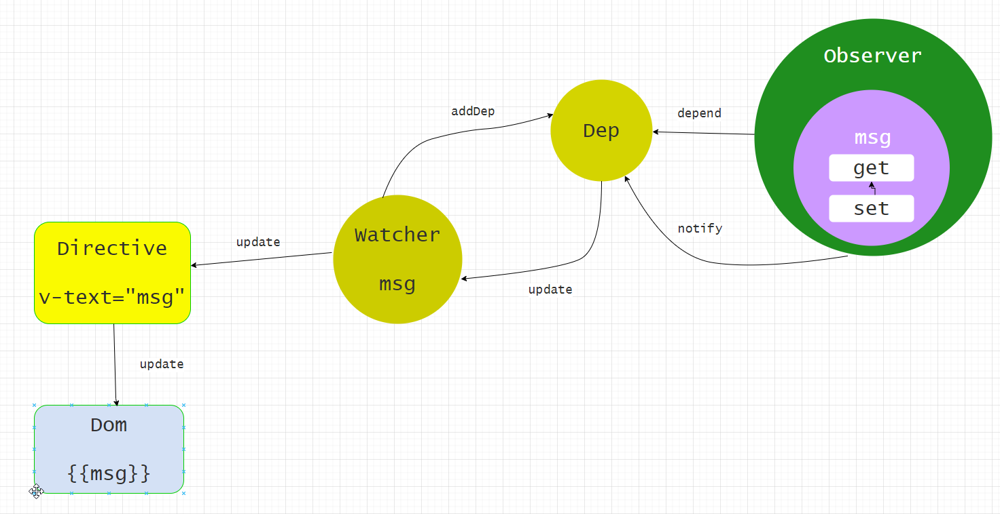

# Vue 双向数据绑定

涉及到的技术

- Object.defineProperty
- Observer
- Watcher
- Dep
- Directive

## 认识Object.defineProperty

```js
function defineReactive(data, key, value) {
    Object.defineProperty(data, key, {
        configurable: true,
        enumerable: true,
        get: function () {
            console.log(`get ${value}`);
            return value;
        },
        set: function (newVal) {
            console.log(`set key: ${key} value ${newVal}`);
            value = newVal;
        }
    });
}

function observer(data) {
    Object.keys(data).forEach(key => {
        defineReactive(data, key, data[key]);
    });
}

let obj = { a: 1 };
let arr = [1, 2, 3];

observer(obj);
observer(arr);

arr.unshift(4);
// get 3
// get 2
// set key: 2 value 2
// get 1
// set key: 1 value 1
// set key: 0 value 4
```

object.defineProperty 可以对对象某个 key 值进行重写，只能重写已有的值，对于新增的 key值无法重写。

执行 arr.unshift(4) 为什么频繁的触发 get 和 set？

因为数组在内存中的存储是连续的，存储的是数组的起始位置和长度。执行 arr.unshift(4)，会先增加数组长度，取出原先最后一位放到现在的最后一位。原先只对下标为 0，1，2重写了 get，set 没有对新增的下标 3 重写，因此只会触发下标为 2 的get，不触发下标为 3 的 set。同理一次对下标 0，1做同样的操作。最后将要 4，填到下标为 0 的位置，即触发 0 的 set。

## 响应式数据原理



### 数据监听过程

在 Vue 初始化阶段，执行 _init 时会执行 initState(vm)。 initState 方法主要对 props、data、methods、computed、watch 进行初始化操作。这里重点分析 initProps 和 initData。

```js
// src/core/instance/state.js
export function initState (vm: Component) {
    vm._watchers = []
    const opts = vm.$options
    if (opts.props) initProps(vm, opts.props)
    if (opts.methods) initMethods(vm, opts.methods)
    if (opts.data) {
        initData(vm)
    } else {
        observe(vm._data = {}, true /* asRootData */)
    }
    if (opts.computed) initComputed(vm, opts.computed)
    if (opts.watch && opts.watch !== nativeWatch) {
        initWatch(vm, opts.watch)
    }
}
```

**分析 initProps 和 initData：**

```js
// src/core/instance/state.js
function initProps (vm: Component, propsOptions: Object) {
  const propsData = vm.$options.propsData || {}
  const props = vm._props = {}
  const keys = vm.$options._propKeys = []
  // ...代码省略
  for (const key in propsOptions) {
    keys.push(key)
    // ...代码省略
    defineReactive(props, key, value)
    if (!(key in vm)) {
      proxy(vm, `_props`, key)
    }
  }
  // ...代码省略
}

function initData (vm: Component) {
  let data = vm.$options.data
  // ...代码省略
  // proxy data on instance
  const keys = Object.keys(data)
  const props = vm.$options.props
  const methods = vm.$options.methods
  let i = keys.length
  while (i--) {
    const key = keys[i]
    // ...代码省略
    proxy(vm, `_data`, key)
  }
  // observe data
  observe(data, true /* asRootData */)
}
```

props 和 data 初始化过程主要做了两件事。

1. 通过 proxy 方法将数据代理到 vm 上。如：`vm._props.xxx ==> vm.xxx`
   `vm._data.xxx ==> vm.xxx`。
2. Vue 遵循单向数据流的原则，props 由父组件传递过来，因此无需 observer，直接使用 defineReactive 方法把 props 每个值变成响应式；而 data 需要进行 observer，在把 data 变成响应式。

**为什么要将数据代理到 vue 实例对象上？**

下面是一段 template 编译后的 js 代码 

```html
<div id='app'>
    <div>
        <h2 v-if="message">{{message}}</h2>
        <button @click="showName">showName</button>
        <div v-if='v'>
            <div>
            <p>我爱你</p>
            <p>你爱我</p>
            <p>蜜雪冰城甜蜜蜜</p>
            </div>
        </div>
    </div>
</div>
```

```js
// this ==> vm
with(this) {
    return _c('div', { attrs: { id: 'app' } }, [
        _c('div', [
            message ? _c('h2', [_v(_s(message))]) : _e(),
            _v(' '),
            _c('button', { on: { click: showName } }, [_v('showName')]),
            _v(' '),
            v ? _c('div', [_m(0)]) : _e()
        ])
    ])
}
```

可以看到 Vue 使用 with 将 this（实例对象）插入到作用域链，因此会访问到实例上的变量，这就解释了为什么要将数据代理到实例对象上。

**分析 observer：**

observe 的功能就是用来监测数据的变化，它的定义在 src/core/observer/index.js 中：

```js
export function observe(value: any, asRootData: ?boolean): Observer | void {
    if (!isObject(value) || value instanceof VNode) {
        return
    }
    let ob: Observer | void
    if (hasOwn(value, '__ob__') && value.__ob__ instanceof Observer) {
        ob = value.__ob__
    } else if (
        shouldObserve &&
        !isServerRendering() &&
        (Array.isArray(value) || isPlainObject(value)) &&
        Object.isExtensible(value) &&
        !value._isVue
    ) {
        ob = new Observer(value)//
    }
    if (asRootData && ob) {
        ob.vmCount++
    }
    return ob
}
```

observe 方法的作用就是给非 VNode 的对象类型数据添加一个 Observer，如果已经添加过则直接返回，否则在满足一定条件下去实例化一个 Observer 对象实例。

```js
export class Observer {
  value: any;
  dep: Dep;
  vmCount: number; // number of vms that have this object as root $data

  constructor(value: any) {
    this.value = value
    this.dep = new Dep();
    this.vmCount = 0
    def(value, '__ob__', this);
    if (Array.isArray(value)) {
      if (hasProto) {
        // [12，4334，].__proto__= arrayMethods
        protoAugment(value, arrayMethods)
      } else {
        copyAugment(value, arrayMethods, arrayKeys)
      }
      this.observeArray(value)
    } else {
      this.walk(value)
    }
  }

  walk(obj: Object) {
    const keys = Object.keys(obj);
    for (let i = 0; i < keys.length; i++) {
      defineReactive(obj, keys[i])
    }
  }

  observeArray(items: Array<any>) {
    for (let i = 0, l = items.length; i < l; i++) {
      observe(items[i])
    }
  }
}
```

Observer 的作用就是重写对象的 getter 和 setter，用于依赖收集和派发更新。

Vue 会对 Array 和 Object 分别处理，对象类型直接调用 defineReactive 进行处理，而数组类型是调用 protoAugment 或 copyAugment 处理（重写原型方法）。

**defineReactive：**

```js

export function defineReactive(
  obj: Object,
  key: string,
  val: any,
  customSetter?: ?Function,
  shallow?: boolean
) {
    const dep = new Dep()
    const property = Object.getOwnPropertyDescriptor(obj, key)
    if (property && property.configurable === false) {
        return
    }

    // cater for pre-defined getter/setters
    const getter = property && property.get
    const setter = property && property.set
    if ((!getter || setter) && arguments.length === 2) {
        val = obj[key]
    }

    let childOb = !shallow && observe(val)
    Object.defineProperty(obj, key, {
        enumerable: true,
        configurable: true,
        get: function reactiveGetter() {
            const value = getter ? getter.call(obj) : val
            if (Dep.target) {
                dep.depend()
                if (childOb) {
                    childOb.dep.depend()
                    if (Array.isArray(value)) {
                        dependArray(value)
                    }
                }
            }
            return value
        },
        set: function reactiveSetter(newVal) {
            const value = getter ? getter.call(obj) : val
            /* eslint-disable no-self-compare */
            if (newVal === value || (newVal !== newVal && value !== value)) {
                return
            }
            /* eslint-enable no-self-compare */
            if (process.env.NODE_ENV !== 'production' && customSetter) {
                customSetter()
            }
            // #7981: for accessor properties without setter
            if (getter && !setter) return
            if (setter) {
                setter.call(obj, newVal)
            } else {
                val = newVal
            }
            childOb = !shallow && observe(newVal)
            dep.notify(); // 通知，数据被修改
        }
    })
}
```

defineReactive 函数最开始初始化 Dep 对象的实例，接着拿到 obj 的属性描述符，然后对子对象递归调用 observe 方法，这样就保证了无论 obj 的结构多复杂，它的所有子属性也能变成响应式的对象，这样我们访问或修改 obj 中一个嵌套较深的属性，也能触发 getter 和 setter。最后利用 Object.defineProperty 去给 obj 的属性 key 添加 getter 和 setter。

### 依赖收集

### 派发更新

在 Vue1 中一个 Watcher 维护着一个指令，dom和数据的关系，因此不需要 dom diff 算法，只需要比较数据的变化，如果数据变化了，就更新 dom。带来后果就是在内存中维护大量的 watcher，占用内存。

在 Vue2 中一个 Watcher 维护的是一个组件中的指令，dom和数据间的关系，是基于组件的颗粒度来建立关系的。因此数据变化时需要进行组件内的 dom diff。页面如果存在大量组件依然会有内存方面的问题，这也就是业内为什么说 vue 不适合写大项目的原因。
