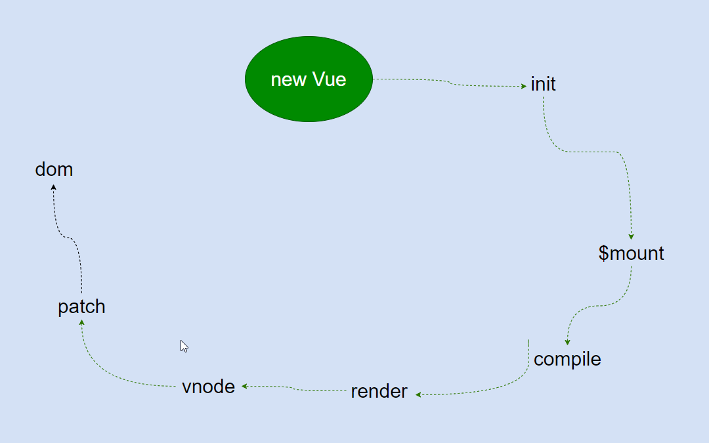

# 模板和数据如何渲染成最终的 DOM。

这里只是分析了最简单和最基础的场景，在实际项目中，我们是把页面拆成很多组件的，组件分析放在 Vue 的组件化过程。

在分析 Vue 实例挂载的实现主要做的事情为：

-   执行 mountComponent 方法；
-   mountComponent 方法的核心是实例化一个 watcher，在 watcher 中执行回调函数 updateComponent；
-   updateComponent 中会调用 vm.\_render 生成 VNode，调用 vm.\_update 更新 DOM

## render

[vm._render 通过 createElement 方法生成一个虚拟 Node。](3.1%20render%20%E7%9A%84%E8%B0%83%E7%94%A8.md)

## virtual DOM

[Virtual DOM 就是用一个原生的 JS 对象去描述一个 DOM 节点](3.2%20virtual%20dom.md)

## createElement

[Virtual DOM 映射到真实的 DOM 上要经过 VNode 的 create，diff，patch 等过程。VNode 是通过 createElement 方法创建的。](3.3%20createElement.md)

## update

[vm._render 创建了一个 VNode 后，就需要把这个 VNode 渲染成一个真实的 DOM 并渲染出来，这个过程是通过 vm._update 完成的](3.4%20update.md)

